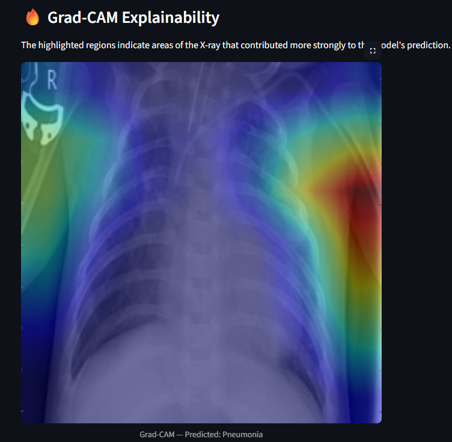

# 🩺 Chest X-Ray Disease Classification using EfficientNet-B0


A deep learning-based chest X-ray classification system that uses **EfficientNet-B0** with transfer learning to classify X-ray images into **COVID-19, Pneumonia, or Tuberculosis**.

The project also uses **Grad-CAM** to visualize image regions that contributed to the model's prediction and provides an interactive **Streamlit web application** for inference.

---

## 🚀 Live Demo

Try the deployed application:

**[Open Chest X-Ray Disease Classification App](https://chest-xray-disease-classification-bzxyec9xdqkpqtsszkkwne.streamlit.app/)**

---

## 🤗 Model Weights

The trained EfficientNet-B0 checkpoint is hosted separately on Hugging Face because large model files are excluded from the GitHub repository.

**[View the EfficientNet-B0 Model on Hugging Face](https://huggingface.co/Sharif-Mahammad/chest-xray-efficientnet-b0)**

The Streamlit application automatically downloads the model from Hugging Face when the local checkpoint is not available.

---

## 📌 Overview

This project implements an end-to-end deep learning pipeline for chest X-ray image classification.

The model predicts one of three classes:

- 🦠 COVID-19
- 🫁 Pneumonia
- 🩻 Tuberculosis

The system combines:

- **EfficientNet-B0** for image classification
- **Transfer learning** using ImageNet-pretrained weights
- **Grad-CAM** for visual explainability
- **Streamlit** for interactive deployment

> **Important:** This is a **single-class classification** system. Each X-ray receives one predicted class with the highest model probability. It is not a multi-label system capable of simultaneously predicting multiple diseases.

---

## ✨ Key Features

- ✅ Three-class chest X-ray classification
- ✅ EfficientNet-B0 transfer learning
- ✅ Image preprocessing and augmentation
- ✅ AdamW optimizer
- ✅ Cosine Annealing learning-rate scheduler
- ✅ Cross-entropy loss with label smoothing
- ✅ Early stopping
- ✅ Grad-CAM explainability
- ✅ Prediction confidence and class probabilities
- ✅ Interactive Streamlit web application
- ✅ GPU-supported training with PyTorch
- ✅ Hugging Face model hosting for deployment

---

## 🏗️ Project Architecture

```text
                    Chest X-Ray Image
                           │
                           ▼
                  Image Preprocessing
                           │
                           ▼
                    Data Augmentation
                           │
                           ▼
                    EfficientNet-B0
                    Transfer Learning
                           │
                           ▼
                     Classification
                           │
              ┌────────────┼────────────┐
              ▼            ▼            ▼
          COVID-19      Pneumonia   Tuberculosis
                           │
                           ▼
                        Grad-CAM
                           │
                           ▼
                   Explainable Heatmap
                           │
                           ▼
                    Streamlit Web App
```

---

## 📂 Project Structure

```text
Chest-XRay-Disease-Classification/
│
├── app.py
├── gradcam.py
├── prepare_data.py
├── train_compare.py
├── requirements.txt
├── .gitignore
└── README.md
```

### Local-only directories

The following directories are intentionally excluded from GitHub because they contain large datasets or generated model/output files:

```text
dataset/
outputs/
```

The trained model checkpoint is hosted on Hugging Face.

---

## 📊 Dataset

The project uses the **Chest X-Ray (Pneumonia, Covid-19, Tuberculosis)** dataset.

Dataset source:

**Kaggle:**  
https://www.kaggle.com/datasets/jtiptj/chest-xray-pneumoniacovid19tuberculosis

The project uses the following three classes:

```text
COVID19
PNEUMONIA
TURBERCULOSIS
```

The dataset is prepared into training, validation, and testing splits.

```text
dataset/
│
├── train/
│   ├── COVID19/
│   ├── PNEUMONIA/
│   └── TURBERCULOSIS/
│
├── val/
│   ├── COVID19/
│   ├── PNEUMONIA/
│   └── TURBERCULOSIS/
│
└── test/
    ├── COVID19/
    ├── PNEUMONIA/
    └── TURBERCULOSIS/
```

---

## 🧹 Data Preparation

The `prepare_data.py` script creates the required three-class dataset structure.

Run:

```bash
python prepare_data.py
```

The dataset and generated files are excluded from GitHub using `.gitignore`.

---

## 🧠 Model

### EfficientNet-B0

The final model used in this project is **EfficientNet-B0**.

It starts with ImageNet-pretrained weights and is adapted for the three-class chest X-ray classification task.

```text
Input X-Ray
     │
     ▼
EfficientNet-B0
     │
     ▼
Feature Extraction
     │
     ▼
Classification Layer
     │
     ▼
3-Class Output
     │
 ┌───┼──────────────┐
 ▼   ▼              ▼
COVID  Pneumonia  Tuberculosis
```

### Training Configuration

| Parameter | Value |
|---|---|
| Model | EfficientNet-B0 |
| Image Size | 224 × 224 |
| Optimizer | AdamW |
| Learning Rate | 3e-4 |
| Batch Size | 32 |
| Scheduler | Cosine Annealing |
| Loss | Cross Entropy with Label Smoothing |
| Pretrained Weights | ImageNet |

---

## 🔥 Explainable AI — Grad-CAM

**Grad-CAM (Gradient-weighted Class Activation Mapping)** is used to provide a visual explanation of the model's prediction.

It generates a heatmap showing image regions that contributed more strongly to the predicted class.

### Grad-CAM Workflow

```text
Chest X-Ray
     │
     ▼
EfficientNet-B0
     │
     ▼
Predicted Class
     │
     ▼
Gradient Calculation
     │
     ▼
Grad-CAM
     │
     ▼
Heatmap Generation
     │
     ▼
X-Ray + Heatmap
```

Grad-CAM helps make the model's prediction more interpretable by showing where the model focused when producing its result.

---

## 🌐 Streamlit Web Application

The project includes an interactive Streamlit application.

### Application Workflow

```text
Upload X-Ray
     │
     ▼
Image Preprocessing
     │
     ▼
EfficientNet-B0
     │
     ▼
Prediction
     │
     ├── Predicted Condition
     ├── Confidence Score
     └── Class Probabilities
     │
     ▼
Grad-CAM Visualization
```

The application allows users to:

1. Upload a chest X-ray image
2. Run the trained EfficientNet-B0 model
3. View the predicted condition
4. View prediction confidence
5. View probabilities for all three classes
6. View the Grad-CAM visualization

---

## 📈 Model Performance

EfficientNet-B0 was evaluated on the prepared test split.

| Metric | Result |
|---|---:|
| Test Accuracy | 100% |
| Test Images | 537 |

The reported result is based on the provided dataset and test split.

> ⚠️ **Important:** The reported performance should not be interpreted as clinical diagnostic accuracy or medical validation. Results on external, unseen, or real-world clinical data may differ.

---

## ⚠️ Classification Behavior

This project performs **single-class classification**, not multi-label disease detection.

For every uploaded X-ray, the model selects the class with the highest predicted probability:

```text
COVID-19
Pneumonia
Tuberculosis
```

If an X-ray contains visual characteristics associated with more than one condition, the current model will still return **one predicted class**.

The system does not currently support outputs such as:

```text
COVID-19 + Pneumonia
```

True multi-label classification would require suitable multi-label dataset annotations, a different output design, an appropriate loss function, and retraining.

---

## 📸 Sample Grad-CAM Output

The application generates a Grad-CAM heatmap over the uploaded chest X-ray to provide an interpretable visualization of the prediction.


```markdown

```

---

## ⚙️ Installation

### 1. Clone the Repository

```bash
git clone https://github.com/Sharif-Mahammad/Chest-XRay-Disease-Classification.git
```

### 2. Navigate to the Project

```bash
cd Chest-XRay-Disease-Classification
```

### 3. Install Dependencies

```bash
pip install -r requirements.txt
```

---

## ▶️ Running the Project

### Step 1 — Prepare the Dataset

After downloading and placing the source dataset in the expected location:

```bash
python prepare_data.py
```

### Step 2 — Train EfficientNet-B0

```bash
python train_compare.py --models efficientnet_b0
```

For the five-epoch training run used during development:

```bash
python train_compare.py --models efficientnet_b0 --epochs 5 --batch-size 32 --num-workers 2
```

The trained checkpoint is saved locally as:

```text
outputs/efficientnet_b0_best.pt
```

### Step 3 — Generate Grad-CAM

```bash
python gradcam.py --checkpoint outputs/efficientnet_b0_best.pt --image <image_path> --output outputs/gradcam_result.png
```

Example:

```bash
python gradcam.py --checkpoint outputs/efficientnet_b0_best.pt --image dataset/test/COVID19/sample.png --output outputs/gradcam_result.png
```

### Step 4 — Launch the Streamlit Application

```bash
python -m streamlit run app.py
```

---

## 🛠️ Tech Stack

| Category | Technology |
|---|---|
| Programming Language | Python |
| Deep Learning Framework | PyTorch |
| Model | EfficientNet-B0 |
| Computer Vision | Torchvision, Pillow |
| Explainable AI | Grad-CAM |
| Data Processing | NumPy, Pandas |
| Visualization | Matplotlib |
| Web Application | Streamlit |
| Model Evaluation | Scikit-learn |
| Model Hosting | Hugging Face |
| Version Control | Git & GitHub |

---

## 🔮 Future Improvements

- 🔹 Multi-label disease classification
- 🔹 Vision Transformer (ViT)
- 🔹 ConvNeXt architecture
- 🔹 Hyperparameter optimization
- 🔹 External dataset evaluation
- 🔹 Model quantization
- 🔹 ONNX deployment
- 🔹 FastAPI inference API
- 🔹 Improved model monitoring

---

## ⚠️ Medical Disclaimer

This project is developed for **educational and research purposes only**.

It is **not a medical diagnostic tool** and should not be used as a substitute for professional medical advice, clinical evaluation, or diagnosis.

Predictions generated by this application should not be used to make healthcare decisions.

---

## 👨‍💻 Author

**Md. Sharif**

- GitHub: https://github.com/Sharif-Mahammad

---

## 📄 License

License information is currently **not specified** for this repository.

If this project is distributed publicly, appropriate licensing and attribution should be added based on the permissions and licensing terms of the source code and dataset.

---

⭐ If you found this project useful, consider giving the repository a star!
